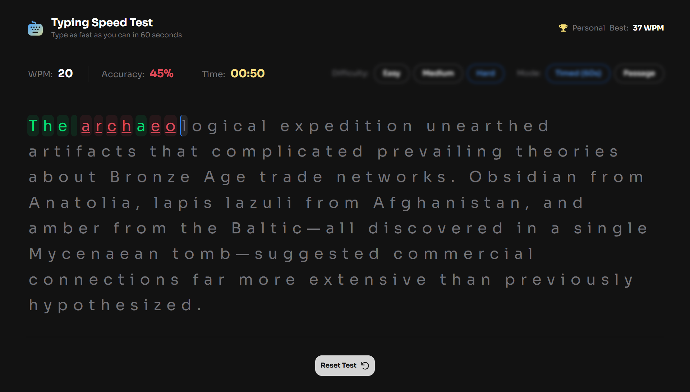
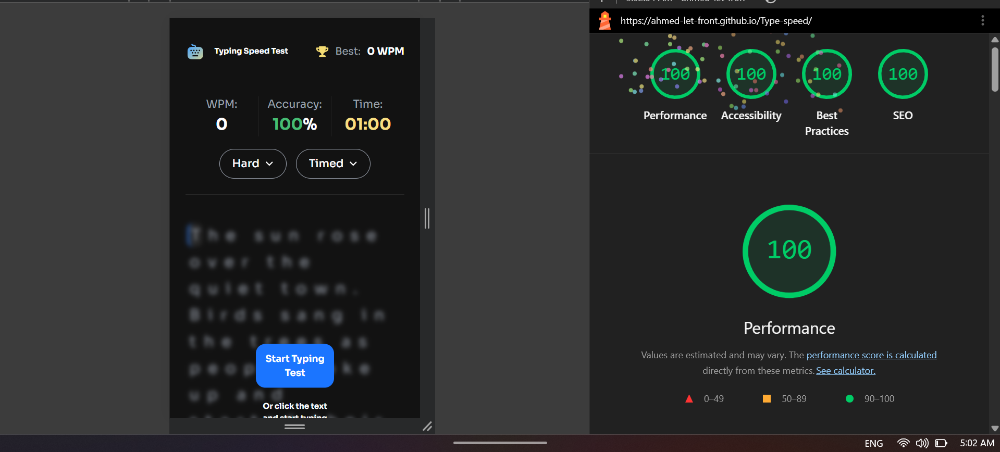

# ⚡ Typing Speed Test // Modern Vanilla JS & Tailwind Architecture

## Overview & Project Scope

A high-performance, feature-rich **Typing Speed Test** web application built from scratch using modern web standards. This project focuses on precise real-time state management, advanced DOM rendering techniques, robust semantic markup, and a seamless user experience.

---

## Hero Preview



---

## Links

- **Live Demo:** [https://ahmed-let-front.github.io/Type-speed/](https://ahmed-let-front.github.io/Type-speed/)
- **Frontend Mentor Solution:** [Frontend Mentor Solution](https://www.frontendmentor.io/challenges/typing-speed-test)

---

## 🤖 AI Collaboration & Engineering Workflow

This project was built using a hybrid development approach, leveraging AI assistance strictly for rapid UI scaffolding under strict architectural guidelines:

- **UI Scaffolding & Semantic Markup:** AI tools were utilized to generate initial Tailwind CSS layouts and semantic HTML5 structures based on precise design prompts.
- **Manual Logic & State Management:** All core JavaScript logic, state management, event listeners (`AbortController`), and application algorithms were manually written, reviewed, and optimized by me.
- **Review & Refinement:** Every line of generated code was rigorously tested, refactored, and audited to guarantee a 400/400 Lighthouse score and absolute memory safety.

---

## Performance & Production Metrics



- **Google Lighthouse Score:** 💯 **400/400** (Perfect 100/100 across Performance, Accessibility, Best Practices, and SEO).

---

## Core Features & Logic Pipelines

### 1. Test Controls & Modes

- **Flexible Start Triggers:** Users can start a test by clicking the start button, clicking directly on the passage text, or immediately by typing.
- **Difficulty Levels:** Selectable difficulty levels (Easy, Medium, Hard) fetching passages dynamically.
- **Dual Modes:** Switch seamlessly between **Timed (60s)** mode and **Passage** mode (count-up timer with no limit).

### 2. Real-Time Typing Experience

- **Live Metrics:** Real-time calculation of Words Per Minute (WPM), accuracy percentage, and elapsed time.
- **Visual Feedback:** Instant character-by-character color-coded feedback (correct characters in green, errors underlined/red) with precise cursor tracking.
- **Error Correction:** Fully supported backspace handling where errors continue to impact overall accuracy metrics.

### 3. Results, Celebration & Persistence

- **Dynamic Feedback & Bests:** Detects the first completed test ("Baseline Established!") and celebrates new personal records ("High Score Smashed!" with confetti animation).
- **Persistent Storage:** Safely serializes and syncs high scores across browser sessions using `localStorage`.

---

## Tech Stack & Implementation Details

- **Core Language:** JavaScript (ES6+ Modules & Clean Architecture)
- **Markup & Structure:** **Semantic HTML5** (`<header>`, `<main>`, `<section>`, `<article>`, `<dialog>`) ensuring maximum accessibility and SEO compliance.
- **Styles & Layout:** **Tailwind CSS v4.x** (Utilizing fluid utility styling and modern CSS features)
- **Bundler & Build Tool:** Vite (Optimized production asset bundling and rapid HMR)

---

## What I Learned & Architectural Highlights

During this project, I focused heavily on advancing my vanilla JavaScript architecture and modern web APIs. Here are some of the key concepts and techniques I implemented:

- **Semantic DOM & Accessibility:** Heavily relied on clean HTML5 semantic tags and the native `inert` attribute to handle screen visibility and focus traps cleanly.
- **AbortController Signals:** Utilized `AbortSignal` to automatically clean up and remove multiple event listeners simultaneously without manual removal boilerplate.
- **Audio Integration:** Programmatically managed and triggered audio feedback loops via JavaScript for enhanced game interactivity.
- **Event Delegation & Grid Transitions:** Handled dynamic dropdown states using CSS Grid template rows scaling combined with clean event delegation patterns.

```js
// Example of using AbortController for clean event handling
const controller = new AbortController();
window.addEventListener('resize', handleResize, { signal: controller.signal });

// Clean up all listeners tied to this signal automatically
controller.abort();
```

## Project Initialization & Local Setup

1. Environment Initialization

```bash
# 1. Initialize the project with Vite
npm create vite@latest . -- --template vanilla

# 2. Install dependencies (Tailwind v4 and GitHub Pages for deployment)
npm install tailwindcss @tailwindcss/vite gh-pages

# 3. Start the local development server
npm run dev
```

2. Version Control & Git Setup

```bash
# Initialize local Git repository & push
git init
git add .
git commit -m "feat: initial Typing Speed Test app setup"
git remote add origin [https://github.com/ahmed-let-front/Type-speed.git](https://github.com/ahmed-let-front/Type-speed.git)
git branch -M main
git push -u origin main
```

## Vite Build Configuration **vite.config.js**

To guarantee a high-performance build process and optimal asset caching:

```javascript
import { defineConfig } from 'vite';
import tailwindcss from '@tailwindcss/vite';

export default defineConfig({
  plugins: [tailwindcss()],
  base: '/Type-speed/',
  build: {
    sourcemap: false,
    rollupOptions: {
      output: {
        assetFileNames: 'assets/[name]-[hash][extname]',
        chunkFileNames: 'assets/[name]-[hash].js',
        entryFileNames: 'assets/[name]-[hash].js',
        manualChunks(id) {
          if (id.includes('node_modules')) {
            return 'vendor';
          }
        },
      },
    },
  },
});
```

## Production Deployment

```bash
# Deploy the production build to GitHub Pages
npm run deploy
```

## Author

GitHub: [ahmed-let-front](https://github.com/Ahmed-let-front)

Frontend Mentor: [Ahmed yasser](https://www.frontendmentor.io/profile/Ahmed-let-front)

LinkedIn: [Ahmed Yasser](https://www.linkedin.com/in/ahmed-yasser-frontend/)

---

**Thanks** Create By **UIO** ❤️
